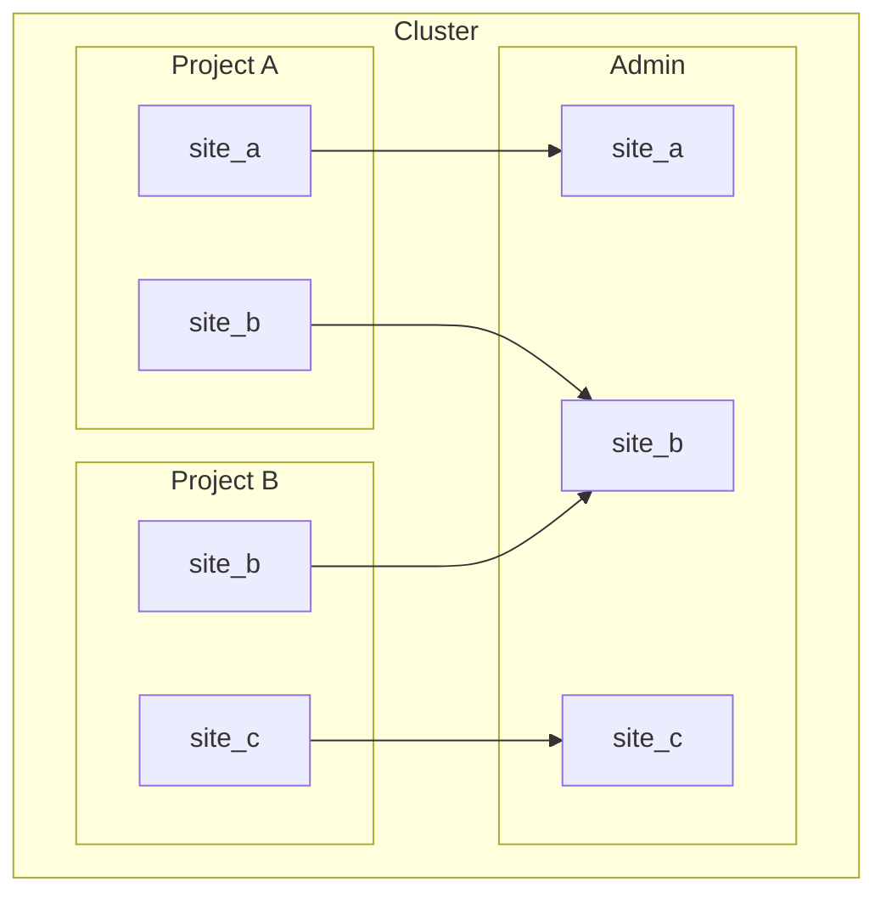
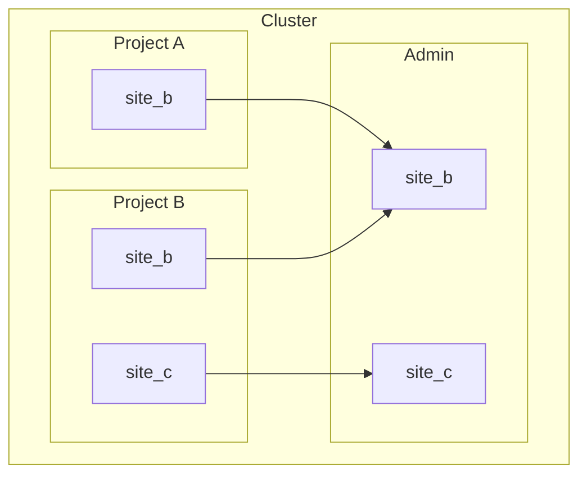
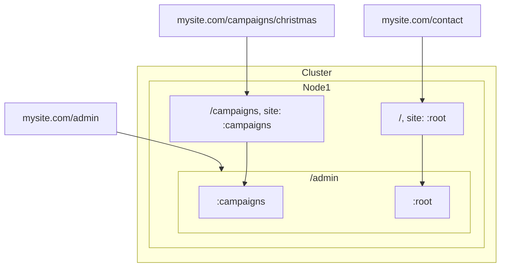
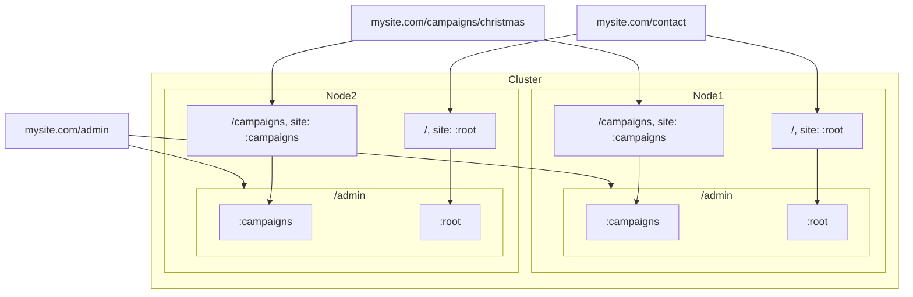
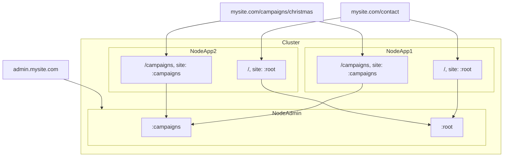
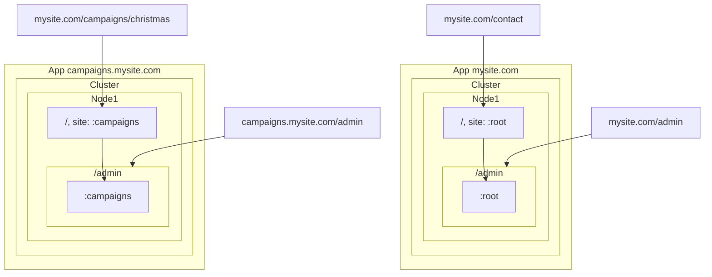
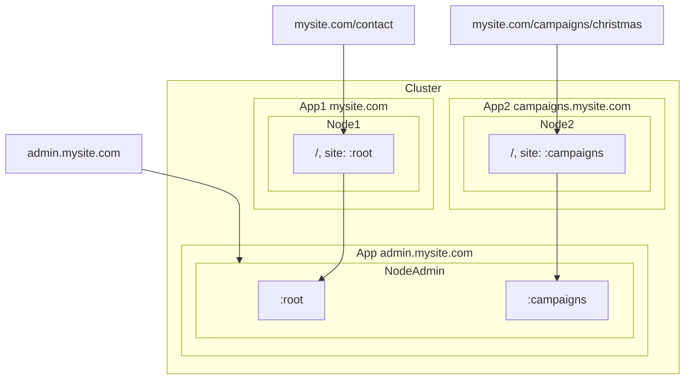

# Deployment Topologies

The routing system in Phoenix combined with the OTP distribution model opens many possibilities for deployment strategies and in this guide we'll cover the most common ones.

Code examples might be abbreviated and infrastructure details like load balancers are not covered in this guide to keep it short.

Clustering your application is also not covered in this guide but you can find the documentation on the platform's site you're using,
for example https://fly.io/docs/elixir/the-basics/clustering and https://www.gigalixir.com/docs/cluster.

## Core Concepts

Firstly, we need to understand a few core concepts:

### URL Generation

The URL of a Beacon Page inside a Phoenix Router [scope](https://hexdocs.pm/phoenix/Phoenix.Router.html#scope/2)
is generated by the combination of the Endpoint and the Router configuration as `endpoint host` + `scope path` + `site prefix` + `page path`, for example:

```elixir
# endpoint
config :my_app, MyAppWeb.Endpoint, url: [host: "mysite.com"]

# router scope
scope "/2024" do
  beacon_site "/campaigns"
end

# beacon page
%Beacon.Content.Page{path: "christmas"}
```

Results in:

```
http://mysite.com/2024/campaigns/christmas`
^                 ^    ^         ^
|                 |    |         |
endpoint          |    |         page path
                  |    site prefix
                  scope path
```

See [Beacon.Router](https://hexdocs.pm/beacon/Beacon.Router.html) and [Phoenix.Router](https://hexdocs.pm/phoenix/Phoenix.Router.html) for added context.


### URL Matching

A common technique to [host multiple sites](https://hexdocs.pm/beacon/multiple-domains-hosting.html) (hosts) in the same application is matching the `:host` in the scope:

```elixir
# only matches requests from sitea.com
scope host: "sitea.com" do
  # ...
end

# only matches requests from siteb.com
scope host: "siteb.com" do
  # ...
end
```

The downside of having such flexibility is creating a configuration that is either invalid or not optimized. Take for instance this configuration:

```elixir
scope host: "sitea.com" do
  beacon_site "/", site: :site_a
end

scope host: "siteb.com" do
  beacon_site "/", site: :site_b
end
```

Note that `:site_b` will never match when deployed to `sitea.com` and `:site_a` will never match on `siteb.com`.
You can already tell that starting `:site_b` in the node that is hosting `sitea.com` is a complete waste of resources since it will never match any request,
which is not a big problem when you have a couple of small sites, but that becomes a problem as your environment grows.

To avoid this problem, Beacon will selectively boot only the sites that are reachable in the current host, so in the example above,
only `:site_a` will be booted in the node hosting `sitea.com` and only `:site_b` in the node hosting `siteb.com`.

Or this other example:

```elixir
scope do
  beacon_site "/", site: :main_site
  beacon_site "/campaigns", site: :campaigns_site
end
```

The macro `beacon_site` creates a catch-all route `/*` so the second site will never be reached since `/campaigns`
is a valid route for the first site.

Those might look obvious but that's a common source of confusion, especially in long and more complex router files.
So Beacon won't try to boot sites that can't be reached, but a warning will be displayed.

### Admin Sites Discovery

[BeaconLiveAdmin](https://hex.pm/packages/beacon_live_admin) is designed to scan the all apps connected in the same cluster to find running sites
and make them available in the admin interface as displayed below:



The most important word here is "running" sites. Suppose `:site_a` in the node Project A is not running, either due to a route conflict, invalid configuration,
or any other reason, then Admin won't find it and it won't be available in the admin interface:



With these constraints in mind, let's check some deployment strategies.

## Strategies

Below we'll describe some common deployment strategies but Beacon is not limited to the strategies below,
you can adapt to your needs.

### 1. Single application on same host
The most simple strategy is a single project with one or more sites and the admin interface in the same host.

```elixir
# endpoint
config :my_app, MyAppWeb.Endpoint, url: [host: "mysite.com"]

# router
scope "/" do
  beacon_live_admin "/admin"
  beacon_site "/campaigns", site: :campaigns
  beacon_site "/", site: :root
end
```



### 2. Clustered single applications
Same project as the previous strategy but with multiple nodes deployed in the same cluster.



### 3. Clustered applications with separated admin
You can observe the previous strategy duplicates the admin interface in each node, which works fairly well when you have
no more than a couple of sites, but that setup tends to become harder to manage and also become a waste of resources
if you start booting more site and more nodes.

So an optimization is to move the Admin interface into its own project and node (a new Phoenix project),
and keep the sites in their own projects.

Note that in order to Admin find the sites, all the apps must be connected in the same cluster.

```elixir
# endpoint
config :my_app, MyAppWeb.Endpoint, url: [host: "admin.mysite.com"]

# router
scope "/" do
  beacon_live_admin "/"
end
```



A huge benefit of this topology is the flexibility to protect the Admin interface behind a VPN or scale it independently from the main applications.

### 4. Multiple hosts in single project, separated hosting apps
Still a single project but now serving multiple sites at the root path for different dynamic hosts.

In this case we're still deploying just one application but serving multiple domains for each site:

- :campaigns -> campaigns.mysite.com
- :root -> mysite.com

TODO: diagram

TODO: gen task and constraints

### 5. Multiple hosts in single project, separated hosting apps
Similar to the previous strategy but this time we're splitting each domain into its own app:

- App1 -> mysite.com
- App2 -> campaigns.mysite.com

That means deploying isolated apps for each domain/site, not connected to each other,
but still sharing the same codebase.

```elixir
# endpoint
host = System.get_env("PHX_HOST")
config :my_app, MyAppWeb.Endpoint, url: [host: host]

# router
scope "/", host: "campaigns.mysite.com" do
  beacon_live_admin "/admin"
  beacon_site "/", site: :campaigns
end

scope "/", host: "mysite.com" do
  beacon_live_admin "/admin"
  beacon_site "/", site: :root
end
```



### 6. Multiple hosts in single project, connected hosting apps
Similar setup as the previous strategy but now connecting the apps in the same cluster with a separated admin interface.

```elixir
# endpoint
host = System.get_env("PHX_HOST")
config :my_app, MyAppWeb.Endpoint, url: [host: host]

# router
scope "/admin", host: "admin.mysite.com" do
  beacon_live_admin "/"
end

scope "/", host: "campaigns.mysite.com" do
  beacon_site "/", site: :campaigns
end

scope "/", host: "mysite.com" do
  beacon_site "/", site: :root
end
```


